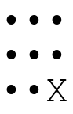

# tic-tac-toe-MCTS

A tic-tac-toe machine learning model that uses Monte Carlo tree search
to train through self-play.

## A self-play game

## How to train a model

Install dependencies with `python -m pip install -r requirements.txt`,
and then run `python train.py`.

## Generate a self-play game

Run `python generate.py`.
